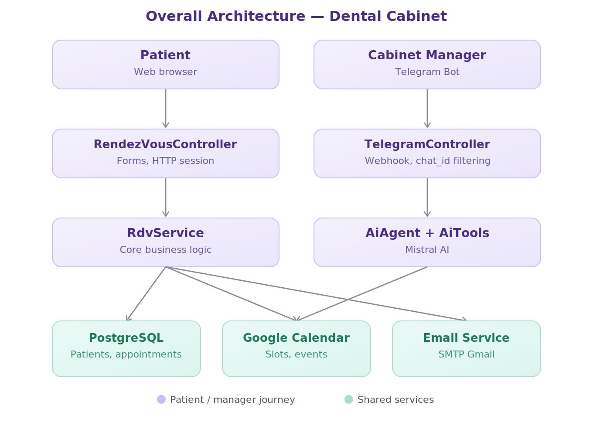
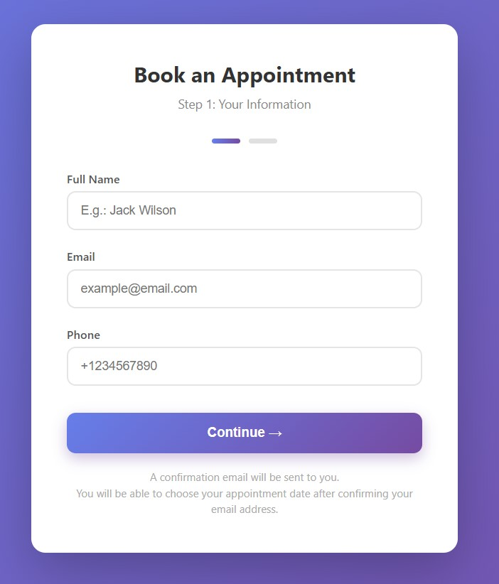
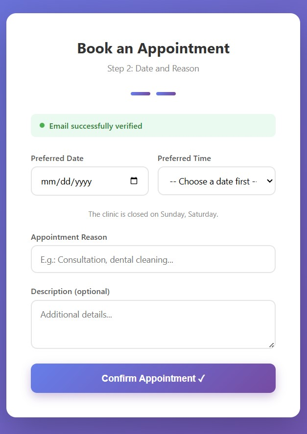
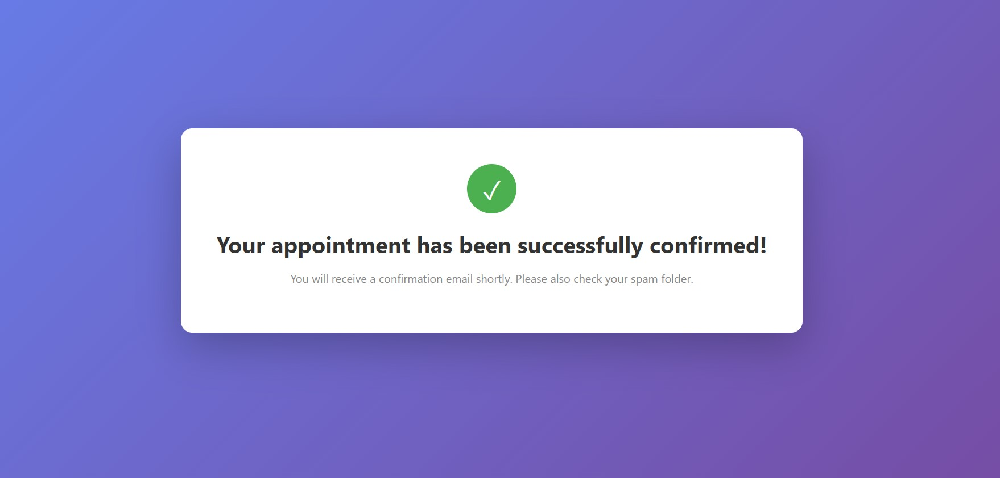
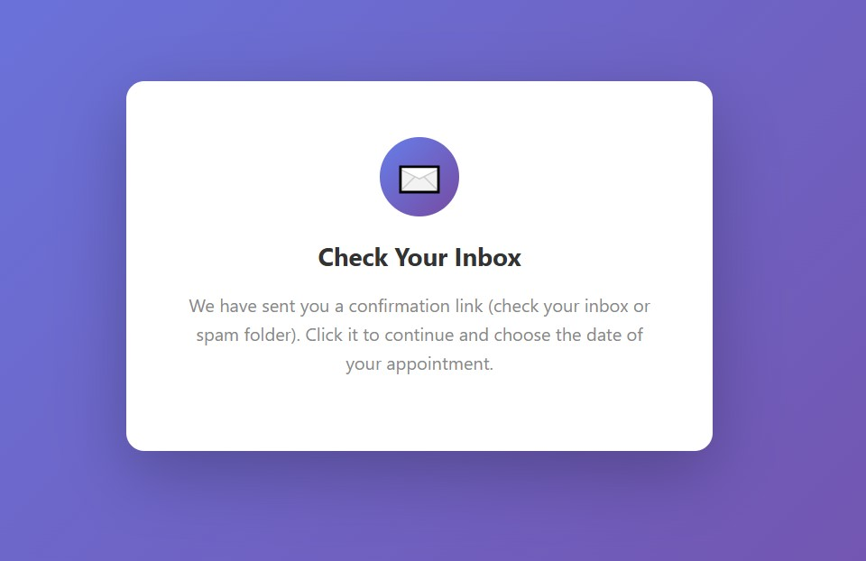
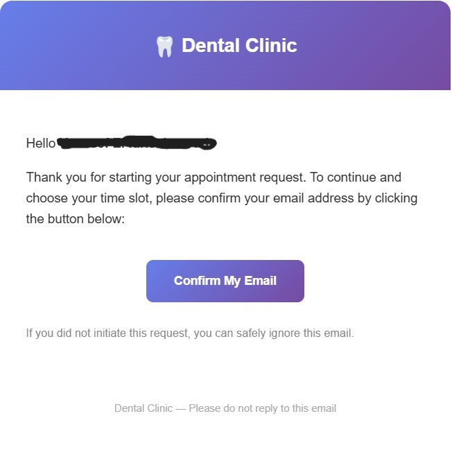
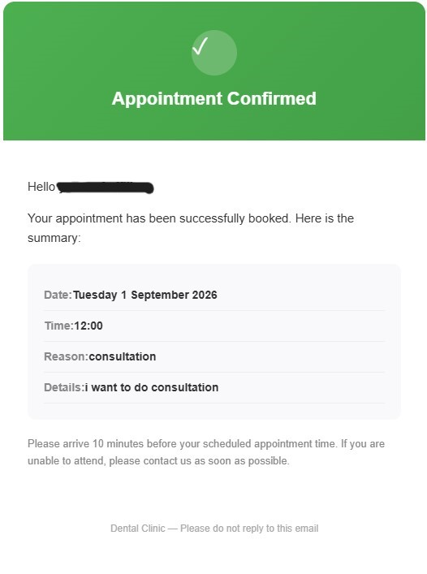
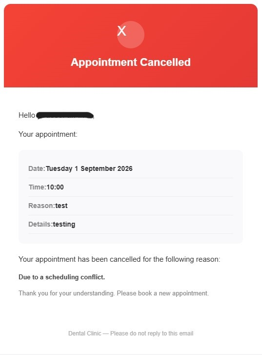
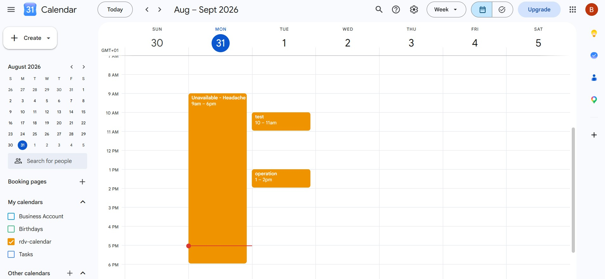
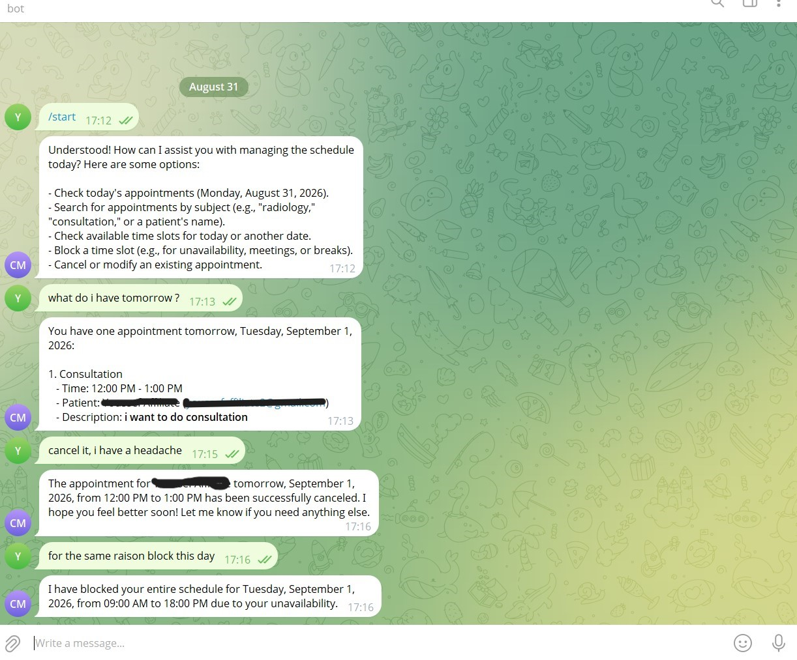

# 🦷 Dental Cabinet — Appointment Management Application

A full-stack application for online appointment booking at a dental practice. It lets a patient book a slot on their own, without a phone call, while the cabinet's manager runs the entire schedule from Telegram, assisted by a conversational AI agent.

The application combines classic server-side rendering (Thymeleaf) on the patient side, a full integration with Google Calendar as the single source of truth for time slots, a transactional email system, and an AI agent (Spring AI + Mistral) able to act directly on the calendar from natural-language commands.

---

## Table of contents

- [Overall architecture](#overall-architecture)
- [Technologies used](#technologies-used)
- [Features](#features)
  - [Patient side](#patient-side)
  - [Cabinet manager side (AI agent / Telegram)](#cabinet-manager-side-ai-agent--telegram)
- [Patient journey — screenshots](#patient-journey--screenshots)
- [Emails sent by the application](#emails-sent-by-the-application)
- [Google Calendar](#google-calendar)
- [AI agent via Telegram](#ai-agent-via-telegram)
- [Security](#security)

---

## Overall architecture

The application is built around two distinct journeys that converge on the same shared services: a web form for the patient, and a conversational Telegram channel for the cabinet manager.

- **Patient** → `RendezVousController` (Thymeleaf forms, HTTP session) → `RdvService` (core business logic)
- **Cabinet manager** → `TelegramController` (webhook, filtering by authorized chat ID) → `AiAgent` (Spring AI + Mistral, dedicated tools)
- Both journeys then rely on the same shared services: **PostgreSQL** (patients, appointment relation), **Google Calendar** (slots, events, source of truth for date/time/reason) and the **Email service** (SMTP Gmail, confirmations and notifications).

---

## Technologies used

**Backend**
- **Spring Boot** — the application's main framework
- **Spring MVC** — web controllers and REST endpoints
- **Spring Security** — form protection (CSRF) and access control
- **Spring Data JPA / Hibernate** — data persistence
- **Spring Validation (Bean Validation)** — form validation (`@NotBlank`, `@Email`, `@Pattern`, `@FutureOrPresent`...)
- **Spring AI** — integration of the conversational agent and its tools
- **Spring Mail (JavaMailSender)** — transactional email sending
- **Spring WebFlux (WebClient)** — reactive HTTP calls to the Telegram API

**Frontend**
- **Thymeleaf** — server-side template engine for the forms (no separate frontend)
- **Custom HTML / CSS** — modern interface, animations, progress indicators, double-submit protection
- **Vanilla JavaScript** — dynamic loading of available time slots via AJAX

**Database**
- **PostgreSQL** — relational database
- **Flyway** — versioned schema migrations

**External services**
- **Google Calendar API** (service account) — creating, updating, cancelling and listing appointments
- **Mistral AI** (via Spring AI) — the language model powering the conversational agent
- **Telegram Bot API** — secure chat channel with the cabinet manager
- **SMTP Gmail** — sending emails (verification, confirmation, cancellation)

---

## Features

### Patient side

- Two-step online booking: personal information, then date/time/reason for the appointment
- Mandatory email verification on the very first visit (link with a limited validity period)
- Simplified booking from the second visit onward: no need to re-verify the email
- Automatic display of genuinely available slots, computed in real time from Google Calendar
- Only one active appointment per patient at a time (protection against duplicate bookings)
- Detailed confirmation email sent after booking
- Opening hours, closing hours and closed days are respected and fully configurable

### Cabinet manager side (AI agent / Telegram)

- View the schedule by day, by week, or over a date range
- Search appointments by reason (e.g., all consultations, all X-rays)
- Cancel an appointment with an automatic email notification to the patient, explaining the reason
- Block a day or a period in case the cabinet is unavailable
- Mark past appointments as completed, freeing the patient up for a new booking
- Add manual events directly to Google Calendar
- Combine several actions to handle complex requests, expressed in natural language

---

## Patient journey — screenshots

**1. Patient information**
First form: name, email and phone number.

**2. Appointment information**
Second form, accessible after email verification: date, time (available slots computed automatically) and reason for the appointment.

**3. Appointment email confirmation**
Message shown once the appointment is finalized, confirming the summary email has been sent.

**4. Verification email confirmation**
Message shown on the first visit, inviting the patient to check their inbox to verify their email address.

---

## Emails sent by the application

**Account verification email** — sent on the patient's first visit, with a confirmation link valid for a limited time.

**Appointment confirmation email** — sent once the appointment is finalized, with the full summary (date, time, reason).

**Cancellation email** — sent when the cabinet manager cancels an appointment, including the reason for the cancellation.

---

## Google Calendar

The cabinet's Google Calendar acts as the single source of truth for all appointments: date, time, reason and description are stored there directly, while the database only keeps the patient ↔ event relationship.

---

## AI agent via Telegram

The cabinet manager talks to the agent in natural language to manage the entire schedule: viewing, creating, cancelling, blocking periods — all without ever needing to open an admin interface.

---

## Security

- Mandatory email verification before any appointment is finalized
- Business rules (opening hours, slot availability, no past dates, closed days) re-checked server-side, independently of JavaScript
- Protection against double submissions and race conditions via the database's `UNIQUE` constraints
- Access to the Telegram agent strictly filtered by conversation ID (`chat_id`), restricted to the cabinet manager
- Sensitive configuration files (Google credentials, tokens, passwords) excluded from the repository via `.gitignore`

